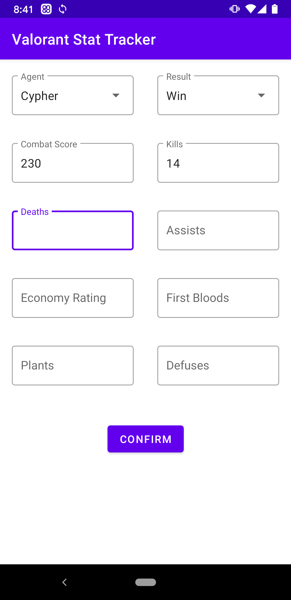

# Valorant Stat Tracker

## Description
An Android mobile application used to record results from a game of Valorant and track your performance from game to game. I started working on this project after taking the "Developing Android Apps in Kotlin" Udacity course in order to gain experience using Kotlin in an Android app.
Built with Kotlin, and Room Persistence.

## Project Status
In Progress. I plan on eventually using the [MPAndroidChart](https://github.com/PhilJay/MPAndroidChart) Library to include charts and graphs, allowing a visual representation of improvement over time.

## Technologies
Kotlin version: 1.4.21  
Lifecycle Library version: 2.2.0  
Room Library version: 2.2.6  
Navigation Library version: 2.3.2  

## Setup
Clone this repository and import into Android Studio  
```bash
git clone https://github.com/matthewopara/valorant-stat-tracker.git
```

## Screenshots
 &nbsp;&nbsp;&nbsp;&nbsp;&nbsp;


