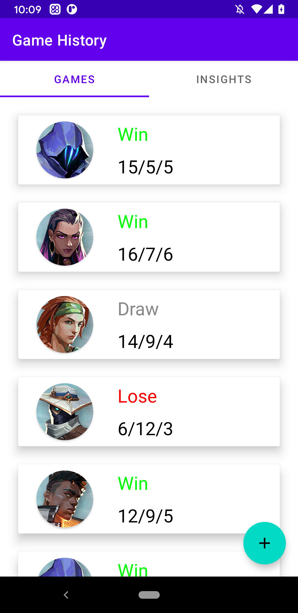

# Valorant Stat Tracker

## Description
An Android mobile application used to record results from a game of Valorant and track your performance from game to game. Also provides a chart to determine your best and worst agents. I started working on this project in order to gain experience using Kotlin in an Android app. This project was started after taking the "Developing Android Apps in Kotlin" Udacity course
## Project Status
In Hiatus...

## Technologies
Kotlin version: 1.4.21  
Lifecycle Library version: 2.2.0  
Room Library version: 2.2.6  
Navigation Library version: 2.3.2  

## Setup
Clone this repository and import into Android Studio  
```bash
git clone https://github.com/matthewopara/valorant-stat-tracker.git
```

## Screenshots
 &nbsp;&nbsp;&nbsp;&nbsp;&nbsp;
 &nbsp;&nbsp;&nbsp;&nbsp;&nbsp;

 &nbsp;&nbsp;&nbsp;&nbsp;&nbsp;


## Run App in Browser
https://appetize.io/app/za0ehmqfqz4bch94ah1h5q3j3g?orientation=portrait&osVersion=10.0
